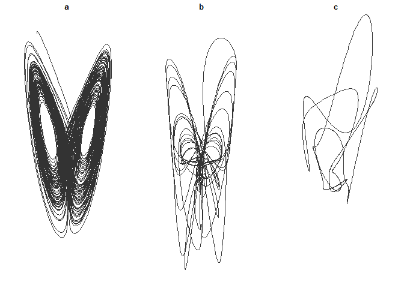

<!-- README.md is generated from README.Rmd. Please edit that file -->
Tangle
======

Tangle is a means of quantifying complexity in relatively short time series data.

Installation
------------

You can install a development version of Tangle from [github](https://github.com) with:

``` r
library(devtools)
install_github("RobertGM111/Tangle")
library(Tangle)
```

Visual
------

Tangle algorithm in process: (a) 0 iterations, (b) 500 iterations, and (c) 10,000 iterations. 

Example
-------

Example use of tangle on a simulated time series

``` r
# Generate data from Lorenz attractor
library(nonlinearTseries)
lorTS <- lorenz(do.plot = FALSE)$x

# Downsample for example speed
samps <- seq(1, length(lorTS), length.out = 500)
lorTS <- lorTS[samps]

# Estimate tau
lorTau <- timeLag(lorTS)

# Calculate Tangle
tangle(lorTS, tau = lorTau)
```
